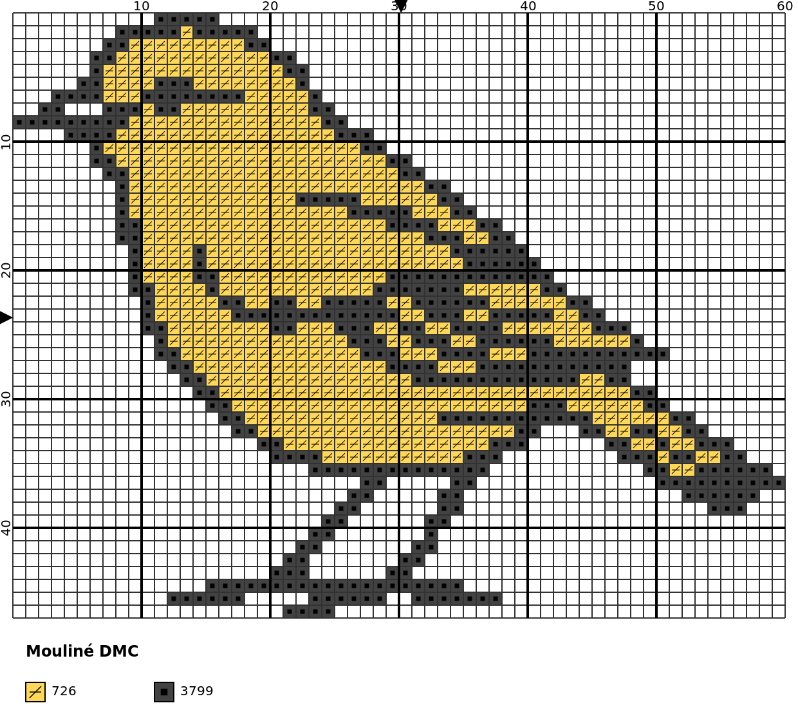

# StitchIt

> [!WARNING]
> WORK IN PROGRESS

🧵/\\/\\/\\✂️/\\/\\/\\🪡/\\/\\/\\🧵/\\/\\/\\✂️/\\/\\/\\🪡/\\/\\/\\🧵/\\/\\/\\✂️/\\/\\/\\🪡

StitchIt can generates a cross stitch chart from an image with ease and free. Main features include:

- User option for number of colors and stitches per row
- DMC colors and symbols are used for a better experience
- Legend with DMC codes and symbols is also produced
- Used thread information is also shown (ready to purchase)
- Background recognition
- Backstitch (limited to background rim, so far)
- CIEDE2000 color perception is used for the most accurate palette
- Optionally, multiple format tweaks can be done to the final chart
- Output formats include svg (vectorized image), png and pdf

> [!NOTE]
> StitchIt is developed with Python 3.10 and tested with pytest.

## Install

> [!IMPORTANT]
> Package soon available in PyPI.

Meanwhile, clone the GitHub repository with:

`gh repo clone girdeux31/StitchIt`

The following third-party modules are required.

- pillow==12.2.0
- cairosvg==2.9.0
- tabulate==0.10.0
- scikit-image>=0.22.0
- numpy>=1.24.3

## Quick guide

`python stitchit.py -i input_file -n n_colors -s stitches_per_row`

Only 3 parameters are mandatory, see the [list of all available options](#sec-options).

- `input_file` (str): image to process
- `n_colors` (int): number of colors
- `stitches_per_row` (int): number of stitches (squares) per row

> [!WARNING]
> If you clone the repo, then call the main script as `python src/stitchit.py`.

For example:

`python3 stitchit.py -i examples/bird.jpg -n 2 -s 60`

That is, use 2 different DMC colors and 60 stitches in each row.

| Original | Chart |
|----------|-------|
||

|

  

  

  
  

## Image recommendations

## Thread information

## Special features

### Background

### Backstitch

## User options

In the table below there is a list of all available user options, along with the type, default value and a comment. Please, read carefully the following notes.

> [!NOTE]
> Only options `--input-file` (or `-i`), `--n-colors` (or `-n`) and `--stitches-per-row` (or `-s`) are mandatory. All others are optional (defaults are included in table).

> [!NOTE]
> No value is needed for options `--no-colors`, `--no-symbols`,`--no-legend`, `--show-background`, `--no-svg`, `--no-png`, `--no-pdf`. Their effect is applied if they are present in the command line. That is way they do not have type or default values. Their default behavior is explained in comments.

> [!NOTE]
> All options that end with `_color` ask for a color. Colors can be specified with CSS4 names as `gray` or HEX codes as `#808080`. See [available colors](https://www.w3.org/TR/css-color-4/#named-colors).

> [!NOTE]
> Options `--background-code`, `--backstitch-code` and `--backstitch-code-no-colors` ask for a DMC code. See [available codes](https://artpatt.com/dmc-color-chart).

> [!NOTE]
> All options that end with `_pixels` ask for a distance in pixels over the SVG file produced.

| **Parameter** | **Type** | **Default** | **Comment** |
|---------------|----------|-------------|-------------|
| `-i` or `--input-file` | `str` || Image file to convert. |
| `-n` or `--n-colors` | `int` || Colors to use in chart (backstitch colors are not included). Parameter must be between 2 and 100, both included. |
| `-s` or `--stitches-per-row` | `int` || Number of stitches/squares/pixels per row in chart. Must be greater or equal than 10. |
| `--no-colors` ||| Produces chart without colors (color specified in parameter `--background-code` is used). By default colors are user. |
| `--no-symbols` ||| Produces chart without symbols. By default symbols are user. |
| `--no-legend` ||| Produces chart without legend. By default legend is shown. |
| `--show-background` ||| Stitches detected as background are drawn with color specified in parameter `--background-code`, without symbols and its color is not shown in legend. Background is detected as the mode of outer rim in input file. By default background is ignored. |
| `--no-svg` ||| Do not save chart as svg file. By default a svg file is generated. |
| `--no-png` ||| Do not save chart as png file. By default a png file is generated. |
| `--no-pdf` ||| Do not save chart as pdf file. By default a pdf file is generated. |
| `--png-scale` | `float` | 2.0 | Scale factor for the png generated file if `--no-png` parameter is not used. |
| `--method` | `str` | `de00` | Method to compute color distance. Options are: `euclidean`, `de76` (deltaE CIE76, like euclidean distance but with LAB coordinates), `de00` (deltaE CIELAB2000, more accurate method as it measure color difference as human perception). |
| `--cleaner-option` | `str` | `strong` | Level of confetti (bad pixels) cleaning. Options are `none`, `moderate` (cleans isoleted pixels) and `strong` (same as `moderate` plus cleans pixels with just one diagonal neighbor). |
| `--background-code` | `str` | `B5200` | DMC code for background color when parameter `--show-background` is not used. |
| `--backstitch-option` | `str` | `none` | Level of backstitching. Options are `none`, `constant` (backstitches with constant color between objects and background, color is defined by parameter `--backstitch-code`) and `inverse` (backstitches with inverse color between objects and background). |
| `--backstitch-code` | `str` | `498` | DMC code for backstitches when parameter `--backstitch-option` is `constant`. |
| `--backstitch-code-no-colors` | `str` | `310` | DMC code for backstitches when parameter `--backstitch-option` is not `none` and `--no-colors` is used. |
| `--fabric-count` | `int` | 14 | AIDA number of squares per inch. Only used to compute thread usage. |
| `--strands` | `int` | 2 | Strands used for stitching. Only used to compute thread usage. |
| `--skein-length-meters` | `float` | 8.0 | Skein length in meters. Only used to compute thread usage. |
| `--strands-per-skein` | `int` | 6 | Strands in a skein. Only used to compute thread usage. |
| `--legend-title` | `str` | `Mouliné DMC` | Legend title. |
| `--legend-title-font-size` | `int` | 12 | Legend title font size. |
| `--legend-title-font-color` | `str` | `black` | Legend title font color. |
| `--legend-title-font-weight` | `str` | `bold` | Legend title font weight. Options are `normal` and `bold`. |
| `--legend-title-x-pixels` | `int` | 20 | Horizontal space before legend title in pixels. |
| `--legend-title-y-pixels` | `int` | 30 | Vertical space before legend title in pixels. |
| `--legend-item-x-pixels` | `int` | 20 | Horizontal space before first legend item in pixels. |
| `--legend-item-y-pixels` | `int` | 20 | Vertical space before first legend item in pixels. |
| `--legend-column-width-pixels` | `int` | 100 | Horizontal space between legend columns in pixels. |
| `--legend-column-height-pixels` | `int` | 30 | Vertical space between legend rows in pixels. |
| `--legend-code-font-color` | `str` | `black` | Font color for each legend item.|
| `--legend-code-font-size` | `int` | 10 | Font size for each legend item. |
| `--legend-box-line-color` | `str` | `black` | Box line color for each legend item. |
| `--legend-box-line-width` | `int` | 1 | Box line width for each legend item. |
| `--major-grid-color` | `str` | `black` | Major grid color. |
| `--major-grid-step-pixels` | `int` | 100 | Space between major gird lines in pixels. |
| `--major-grid-width` | `int` | 2 | Major gird line width. |
| `--minor-grid-color` | `str` | `#323232` | Minor grid color. Default is `#323232`. |
| `--minor-grid-step-pixels` | `int` | 10 | Space between minor gird lines in pixels. |
| `--minor-grid-width` | `int` | 1 | Minor gird line width. |
| `--coords-font-color` | `str` | `black` | Coordinates color in outer margin. |
| `--coords-font-size` | `int` | 10 | Coordinates font size. |
| `--coords-step-units` | `int` | 10 | Space between coordinate numbers in minor grid units. |
| `--coords-gap-pixels` | `int` | 2 | Space between coordinates and chart in pixels. |
| `--arrow-color` | `str` | `black` | Arrow color in outer margin. |
| `--arrow-gap-pixels` | `int` | 2 | Space before arrow and chart in pixels. |
| `--symbol-color` | `str` | `black` | Symbol color when parameter `--no-symbols` is not used. |
| `--symbol-line_width` | `int` | 1 | Symbol line width when parameter `--no-symbols` is not used. |
| `--backstitch_line_width` | `int` | 2 | Backstitch line width when parameter `--backstitch-option` is not `none`. |

> [!WARNING]
> Of course, you can produce a chart without colors, symbols and legend (with options `--no-colors`, `--no-symbols` and `--no-legend`), but then, you will get an empty chart.

## Known bugs and limitations

## Future work

The following ideas can be implemented in the future. It is not planed to do so, but maybe someone will fork this repo.

[ ] Improve backstitch with inner rims and/or other options
[ ] Implement half and quarter stitches

## Acknowledgements

This repo is a fork (see [original repo](https://github.com/PaulMakesStuff/Python_Cross_Stitch)), but it has been refactored in a 99.9%.

## Contact

Feel free to [contact me](mailto:mesado31@gmail.com) for any suggestion or bug.
