# <a id="sec-top"></a>StitchIt

🧵/\\/\\/\\✂️/\\/\\/\\🪡/\\/\\/\\🧵/\\/\\/\\✂️/\\/\\/\\🪡/\\/\\/\\🧵/\\/\\/\\✂️/\\/\\/\\🪡

StitchIt generates a cross stitch chart from an image for free. Main features include:

- User option for number of colors and stitches per row
- DMC colors and symbols are used for a better experience
- Legend with DMC codes and symbols is also produced
- Thread information is also shown (ready to purchase)
- Aida simulation (image background replaced)
- Backstitch (limited to background-objects border, so far)
- CIEDE2000 color perception is used for the most accurate palette
- Optionally, multiple format tweaks for the chart
- Output formats include svg (vectorized image), png and pdf

> [!NOTE]
> StitchIt is developed with Python 3.10 and tested with pytest.

## <a id="sec-install"></a>Install

Direclty from PyPI. It will create an entrypoint to call the main script if you write `stitchit` in the terminal.

`pip install stitchit`

The following third-party modules are required.

- pillow>=12.2.0
- cairosvg>=2.9.0
- tabulate>=0.10.0
- scikit-image>=0.22.0
- numpy>=1.24.3

You could also clone the GitHub repository with:

`gh repo clone girdeux31/StitchIt`

## <a id="sec-guide"></a>Quick guide

`stitchit -i input_file -n n_colors -s stitches_per_row`

> [!WARNING]
> If you clone the repo, then call the main script as `python src/stitchit`.

Only 3 parameters are mandatory, see the [list of all available options](#sec-options).

- `input_file` (str): image to process
- `n_colors` (int): number of DMC colors
- `stitches_per_row` (int): number of stitches (squares) per row

For example:

`stitchit -i examples/bird.jpg -n 2 -s 60`

That is, use 2 different DMC colors and 60 stitches in each row.

| Original | Chart |
|----------|-------|
|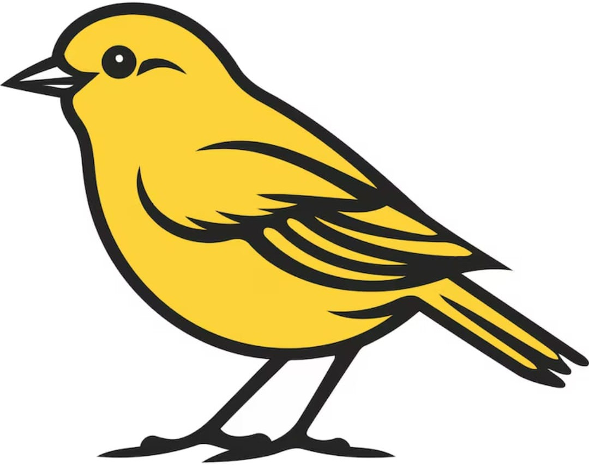|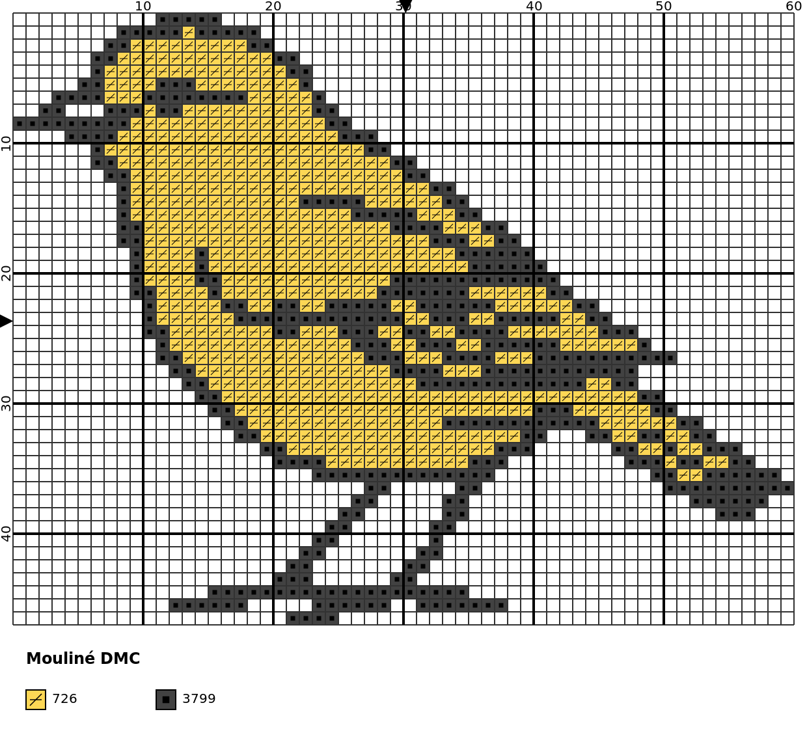|

## <a id="sec-recommendations"></a>Image recommendations

The following recommendations apply to input images:

- Cartoonish images
- Plain colors or slightly shaded
- Few details
- Homogeneous backgrounds
- No gray-scale images

The previous image is a good one but it is rather simple. A greater variety of colors is handled properly (increase `n-colors` accordingly). For example:

`stitchit -i examples/einstain.jpg -n 5 -s 80`

| Original | Chart |
|----------|-------|
||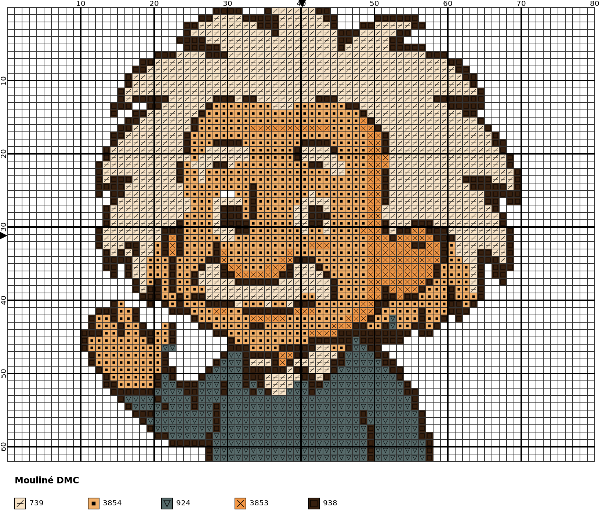|

You can use any image, but the output of a real photography is not something you would stitch.

| Original | Ugly chart |
|----------|-------|
|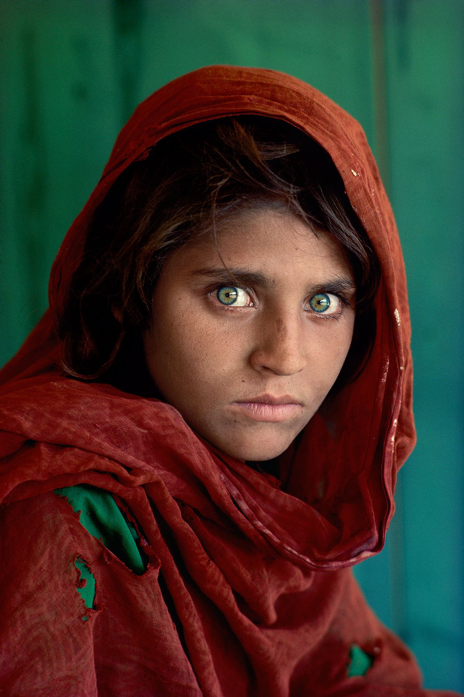|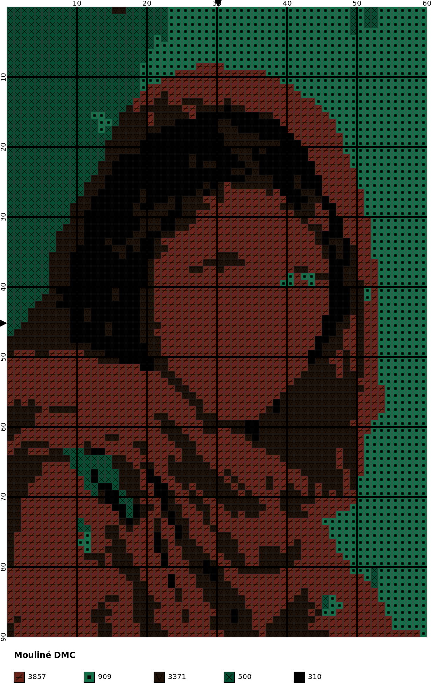|
|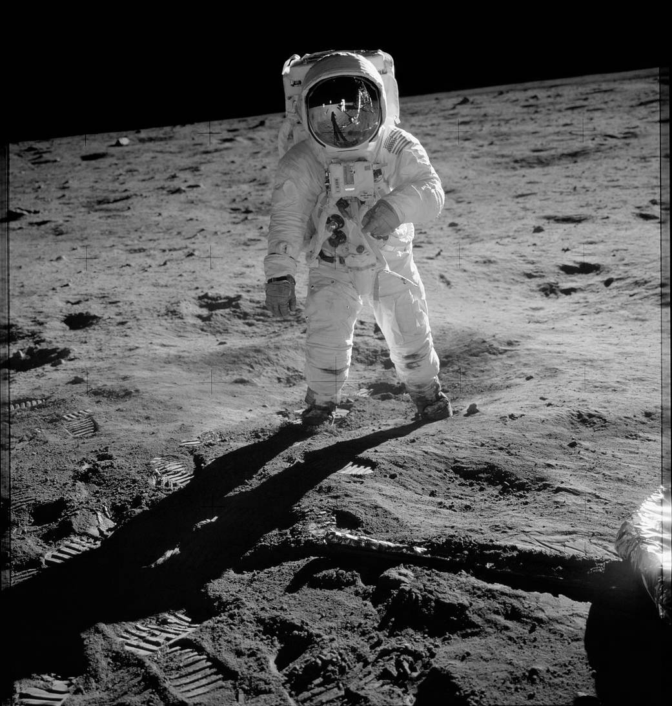|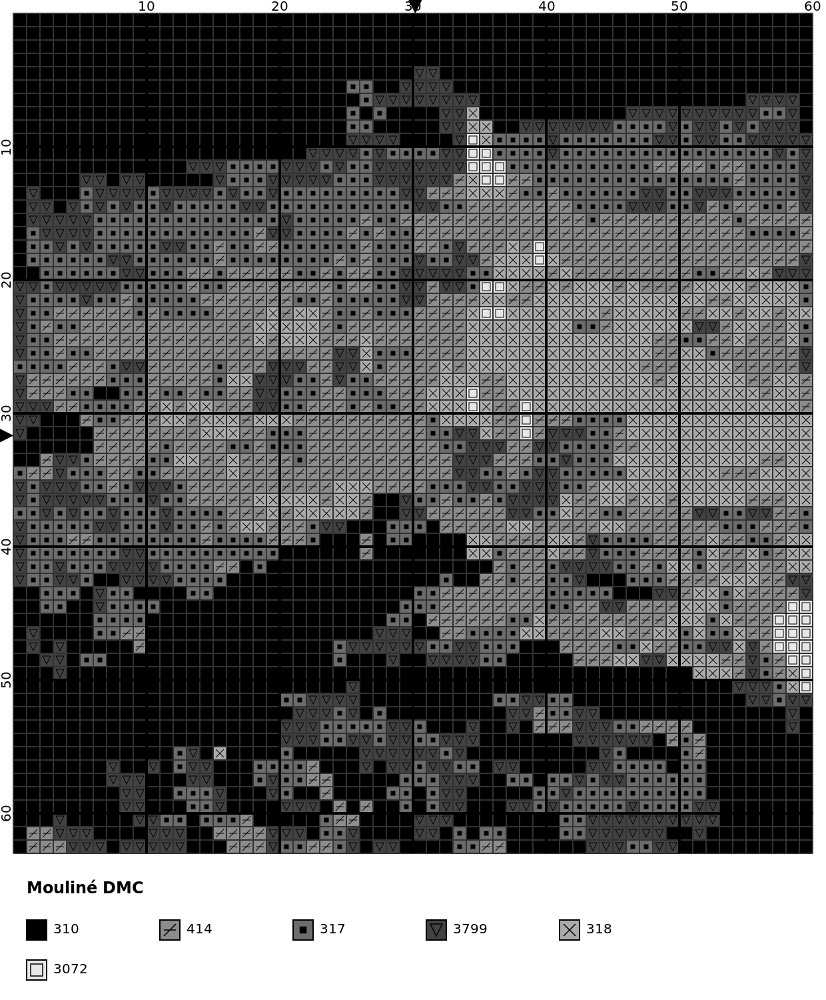|

If you must use a real photography, try to convert it first with your favorite AI tool. You can use this prompt:

> I attached an image. Can you convert it to a cartoonish picture so I can run it through an image-to-cross-stitch-chart program? Use plain colors or slightly shaded, few details, and homogeneous backgrounds. If it is in gray-scale, try to colorize it first.

| Original | Chart |
|----------|-------|
|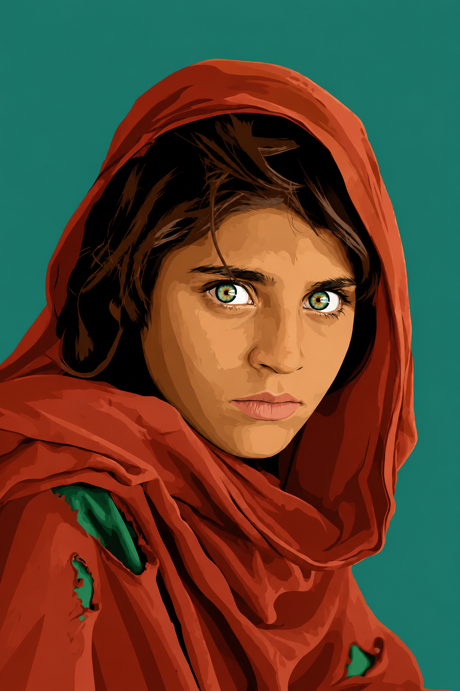|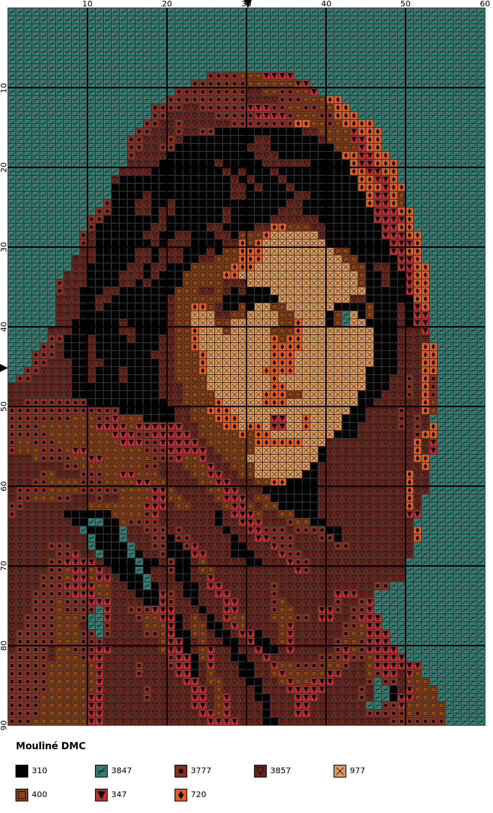|

## <a id="sec-thread"></a>Thread information

Beside the cross stitch chart, a file (txt format) with design and thread information is generated. For example, for the first image shown above (`bird.jpg`):

```
Design information:

  Fabric count or Aida count: 14 (ct or stitches per inch)
  Strands for stitching: 2 strands
  Size (width x height): 10.89x8.53 (cm) or 4.29x3.36 (in)
  Stitches (width x height): 60x47

Thread information:

  DMC code  DMC color              DMC RGB       Stitches    Length (m)    Skeins     MSE
----------  ---------------------  ----------  ----------  ------------  --------  ------
       726  Light Topaz            253,215,85         628         11.30         1  0.5451
      3799  Very Dark Pewter Gray  66,66,66           466          8.39         1  0.0060
```

This includes approx design real dimensions, thread usage information (based on Aida number, see `--fabric-count`), skeins to purchase and color MSE (error with respect to real image).

## <a id="sec-featuers"></a>Special features

Among all optional options, there are two that is worth explaining in its own section.

### <a id="sec-bg"></a>Background

By default, image background is automatically detected and left as part of the Aida cloth. Besides:

- Color given by `--aida-color` is used in chart (default is white)
- No symbol is given to those stitches
- Aida color is not shown in legend

However, image background can be rendered as stitches with `--no-aida`. For example:

`stitchit -i examples/bird.jpg -n 3 -s 60 --no-aida`

| Default | With `--no-aida` |
|----------|-------|
|||

> [!WARNING]
> When `--no-aida` is present (not the default behavior), the image background takes up one color. Thus, to produce the same chart as the default behavior (background as Aida cloth) option `--n-colors` (or `-n`) must be increase by 1.

Background color is detected as the mode of the image outer border.

### <a id="sec-bs"></a>Backstitch

Backstitch is controlled with `--backstitch-option`. So far, only backstitch between objects and background is produced. It has 3 different options:

- `none`: no backstitch is included in chart
- `constant`: backstitch with constant color (given by `--backstitch-code`)
- `inverse`: backstitch with object inverse color (most similar DMC color)

For example:

`stitchit -i examples/einstain.jpg -n 5 -s 80 --backstitch-option constant --backstitch-code 498 --aida-color "#EFF4A4"`

`stitchit -i examples/einstain.jpg -n 5 -s 80 --backstitch-option inverse --aida-color "#EFF4A4"`

| `--backstitch-option constant` | `--backstitch-option inverse` |
|------------|-----------|
|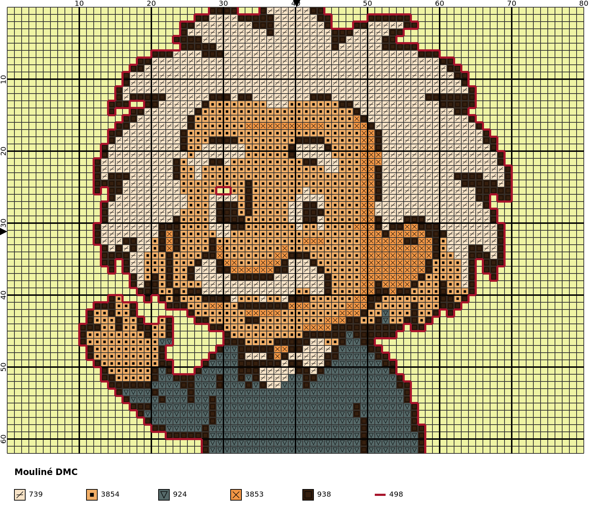|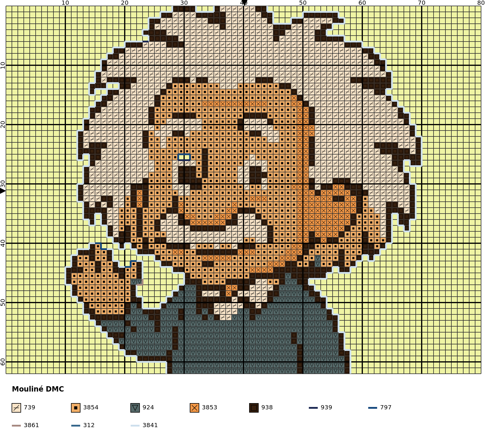|

Additional control over backstitches is given by `--backstitch-code` (if `--backstitch-option` is `constant`) and `--backstitch-line-width`. Backstitch colors are also included in legend. Note that colors in legend are sorted according to the number of stitches (first cross stitches, then backstitches).

## <a id="sec-options"></a>User options

In the table below there is a list of all available user options, along with the type, default value and a comment. Please, read carefully the following notes.

> [!NOTE]
> Only options `--input-file` (or `-i`), `--n-colors` (or `-n`) and `--stitches-per-row` (or `-s`) are mandatory. All others are optional (defaults are included in table).

> [!NOTE]
> No value is needed for options `--no-colors`, `--no-symbols`,`--no-legend`, `--no-aida`, `--no-svg`, `--no-png` and `--no-pdf`. Their effect is applied if they are present in the command line. That's way they don't have type or default values. Their default behavior is explained in comments.

> [!NOTE]
> Options `--backstitch-code` and `--backstitch-code-no-colors` ask for a DMC code. See [available DMC codes](https://artpatt.com/dmc-color-chart).

> [!NOTE]
> All options that end with `-color` ask for a color. Colors can be specified with CSS4 names as `gray` or HEX codes as `"#808080"`. See [available CSS4 colors](https://www.w3.org/TR/css-color-4/#named-colors).

> [!WARNING]
> Double quotes must be used if HEX code is used as color, otherwise the terminal thinks it is a comment since it has the character `#`.

> [!NOTE]
> All options that end with `-pixels` ask for a distance in pixels over the SVG file produced.

| **Parameter** | **Type** | **Default** | **Comment** |
|---------------|----------|-------------|-------------|
| `-i` or `--input-file` | `str` || Image file to convert. Required. |
| `-n` or `--n-colors` | `int` || DMC colors to use in chart (backstitch colors are not included). Parameter must be between 2 and 100, both included. Required. |
| `-s` or `--stitches-per-row` | `int` || Number of stitches/squares/pixels per row in chart. Must be greater or equal than 10. Required. |
| `--no-colors` ||| Produces chart without colors (color specified in `--aida-color` is used). By default colors are used. |
| `--no-symbols` ||| Produces chart without symbols. By default symbols are used. |
| `--no-legend` ||| Produces chart without legend. By default legend is shown. |
| `--no-aida` ||| Image background is rendered as more stitches in chart if this option is present. By default Aida is shown, that is, stitches detected as background are drawn with color specified in `--aida-color`, without symbols and its color is not shown in legend (simulating Aida cloth). Background is detected as the mode of outer image borders. |
| `--no-svg` ||| Don't save chart as svg file. By default a svg file is generated. |
| `--no-png` ||| Don't save chart as png file. By default a png file is generated. |
| `--no-pdf` ||| Don't save chart as pdf file. By default a pdf file is generated. |
| `--png-scale` | `float` | 2.0 | Scale factor for the png generated file if `--no-png` is not used. |
| `--method` | `str` | `de00` | Method to compute color distance. Options are: `euclidean`, `de76` (deltaE CIE76, like euclidean distance but with LAB coordinates), `de00` (deltaE CIELAB2000, more accurate method as it measure color difference as human perception). |
| `--cleaner-option` | `str` | `strong` | Level of confetti (bad pixels) cleaning. Options are `none`, `moderate` (cleans isoleted pixels) and `strong` (same as `moderate` plus cleans pixels with just one diagonal neighbor). |
| `--aida-color` | `str` | `white` | Color for Aida cloth when `--no-aida` is not used (default). Take into account that it is drawn in chart as the most similar DMC color. |
| `--backstitch-option` | `str` | `none` | Level of backstitching. Options are `none`, `constant` (backstitches with constant color between objects and background, color is defined by `--backstitch-code`) and `inverse` (backstitches with inverse color between objects and background). |
| `--backstitch-code` | `str` | `498` | DMC code for backstitches when `--backstitch-option` is `constant`. |
| `--backstitch-code-no-colors` | `str` | `310` | DMC code for backstitches when `--backstitch-option` is not `none` and `--no-colors` is used. |
| `--fabric-count` | `int` | 14 | Aida number of squares per inch. Only used to compute thread usage. |
| `--strands` | `int` | 2 | Strands used for stitching. Only used to compute thread usage. |
| `--skein-length-meters` | `float` | 8.0 | Skein length in meters. Only used to compute thread usage. |
| `--strands-per-skein` | `int` | 6 | Strands in a skein. Only used to compute thread usage. |
| `--legend-title` | `str` | `Mouliné DMC` | Legend title. |
| `--legend-title-font-size` | `int` | 12 | Legend title font size. |
| `--legend-title-font-color` | `str` | `black` | Legend title font color. |
| `--legend-title-font-weight` | `str` | `bold` | Legend title font weight. Options are `normal` and `bold`. |
| `--legend-title-x-pixels` | `int` | 20 | Horizontal space before legend title in pixels. |
| `--legend-title-y-pixels` | `int` | 30 | Vertical space before legend title in pixels. |
| `--legend-item-x-pixels` | `int` | 20 | Horizontal space before first legend item in pixels. |
| `--legend-item-y-pixels` | `int` | 20 | Vertical space before first legend item in pixels. |
| `--legend-column-width-pixels` | `int` | 100 | Horizontal space between legend columns in pixels. |
| `--legend-column-height-pixels` | `int` | 30 | Vertical space between legend rows in pixels. |
| `--legend-code-font-color` | `str` | `black` | Font color for each legend item.|
| `--legend-code-font-size` | `int` | 10 | Font size for each legend item. |
| `--legend-box-line-color` | `str` | `black` | Box line color for each legend item. |
| `--legend-box-line-width` | `int` | 1 | Box line width for each legend item. |
| `--svg-fill-color` | `str` | `none` | SVG background color (outside chart). Use `none` for transparent color. |
| `--major-grid-color` | `str` | `black` | Major grid color. |
| `--major-grid-step-pixels` | `int` | 100 | Space between major gird lines in pixels. |
| `--major-grid-width` | `int` | 2 | Major gird line width. |
| `--minor-grid-color` | `str` | `#323232` | Minor grid color. Default is `#323232`. |
| `--minor-grid-step-pixels` | `int` | 10 | Space between minor gird lines in pixels. |
| `--minor-grid-width` | `int` | 1 | Minor gird line width. |
| `--coords-font-color` | `str` | `black` | Coordinates color in outer margin. |
| `--coords-font-size` | `int` | 10 | Coordinates font size. |
| `--coords-step-units` | `int` | 10 | Space between coordinate numbers in minor grid units. |
| `--coords-gap-pixels` | `int` | 2 | Space between coordinates and chart in pixels. |
| `--arrow-color` | `str` | `black` | Arrow color in outer margin. |
| `--arrow-gap-pixels` | `int` | 2 | Space before arrow and chart in pixels. |
| `--symbol-color` | `str` | `black` | Symbol color when `--no-symbols` is not used. |
| `--symbol-line-width` | `int` | 1 | Symbol line width when `--no-symbols` is not used. |
| `--backstitch-line-width` | `int` | 3 | Backstitch line width when `--backstitch-option` is not `none`. |

> [!WARNING]
> A chart without colors, symbols and legend can be generated (with options `--no-colors`, `--no-symbols` and `--no-legend`), but then, you will get an empty chart.

## <a id="sec-work"></a>Future work

The following ideas can be implemented in the future. It is not planned to do so, but maybe someone will fork this repo.

- [ ] Improve backstitch with inner borders and/or other options
- [ ] Implement half and quarter stitches

## <a id="sec-acknowledgements"></a>Acknowledgements

This repo is a fork (see [original repo](https://github.com/PaulMakesStuff/Python_Cross_Stitch)), but it has been refactored in a 99.9% and substantially extended.

## <a id="sec-contact"></a>Contact

Feel free to [contact me](mailto:mesado31@gmail.com) for any suggestion or bug.
